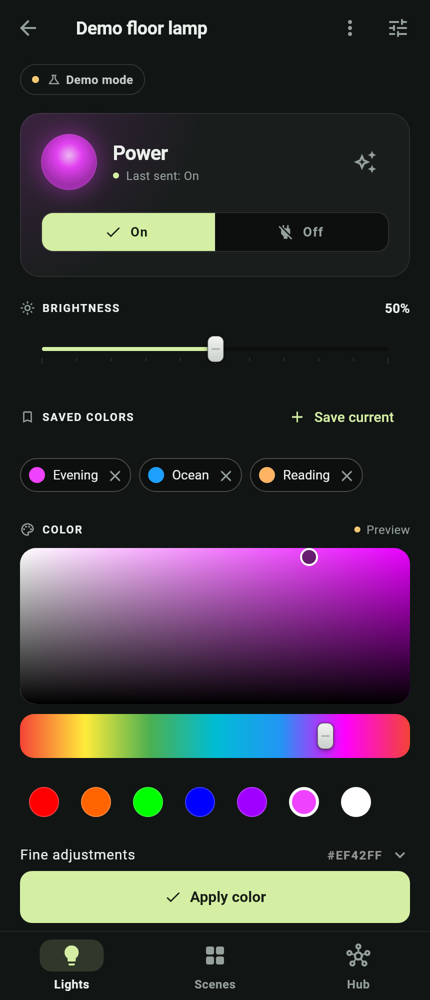
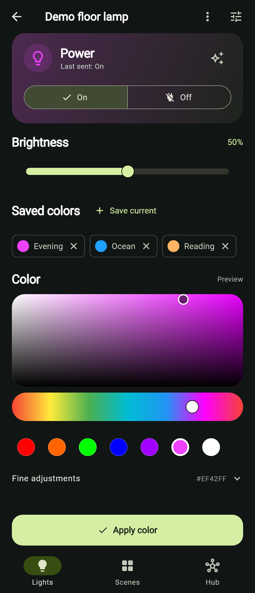
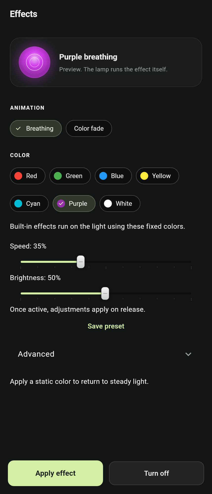
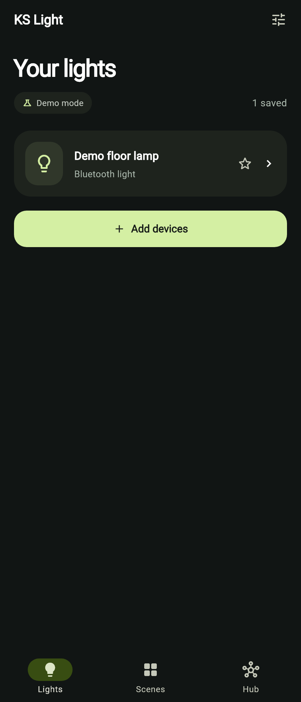
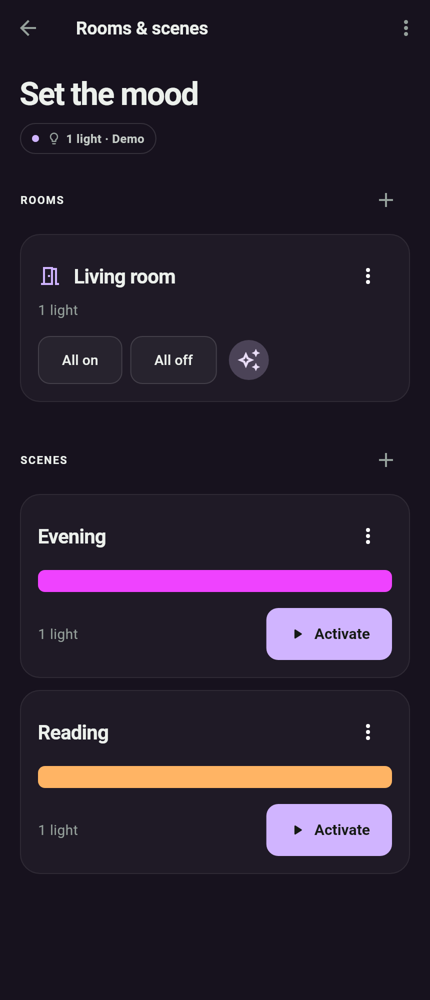
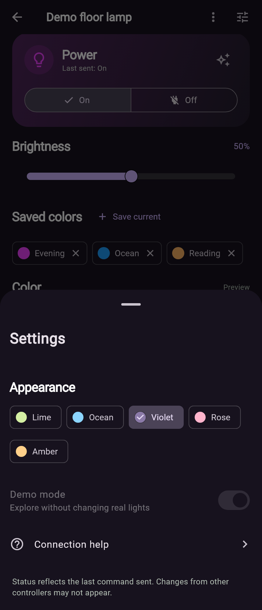

# KS Light


Local control for compatible KS Bluetooth lights, with an Android app and an optional hub for integrations. No cloud account is required for direct Bluetooth control.

**Android 1.2.1 / build 6 is available in the [first public prerelease](https://github.com/H4ch1Net/ks-led-controller/releases/tag/v1.2.1-rc.1).** Download `KS-Light-1.2.1.apk` from GitHub Releases. No Google Play release is planned.

[Current status](docs/v2/CURRENT_STATUS.md) · [Release plan](docs/v2/GITHUB_RELEASE_PLAN.md) · [Documentation](docs/v2/README.md) · [MIT license](LICENSE)

## The Android app

- Add multiple lights, rename them and choose a default.
- Control power, brightness and color, with per-light color balance.
- Save named color/brightness presets and organize rooms and scenes.
- Choose an animation, then its color or palette. Built-in KS03 effects run on the lamp; custom phone effects offer more choices.
- Add home-screen widgets, a Quick Settings tile and Android Device Controls.
- Choose Lime, Ocean, Violet, Rose or Amber under Settings → Appearance.
- Connect to an optional hub for shared controls and Home Assistant.

### Screenshots

App screens with demo lights and scenes. [How the screenshots are captured](docs/images/README.md).

<table>
<tr>
<td></td>
<td></td>
<td></td>
</tr>
<tr><td>Light controls</td><td>Saved colors</td><td>Built-in effects</td></tr>
<tr>
<td></td>
<td></td>
<td></td>
</tr>
<tr><td>Your lights</td><td>Rooms &amp; scenes</td><td>Appearance</td></tr>
</table>

## Getting started

### Android: control a light directly

Android 7.0 or later and a compatible Bluetooth light are required. A PC, Raspberry Pi or hub is **optional**.

1. Download `KS-Light-1.2.1.apk` from the [GitHub prerelease](https://github.com/H4ch1Net/ks-led-controller/releases/tag/v1.2.1-rc.1). Avoid APK mirrors; verify it against `SHA256SUMS-public.txt`.
2. Install the APK and grant Bluetooth access when requested. Older Android versions may also require location access for scanning.
3. Choose **Add devices** / **Scan for lights**, then select your light. Use the star to make it the default.
4. Choose a color and brightness, then **Apply color**. Use **Saved colors → Save current** to name a preset. Tapping a saved color previews it; Apply sends it.
5. Open **Effects** for animation and color choices, or **Settings → Appearance** to change the app theme.

Public updates use a permanent signing certificate. Older private development-signed builds cannot update directly to the public APK. Keep your existing install until its configuration is preserved; the rooms/scenes export is not a full backup. Read the [migration and signing instructions](apps/android/README.md#private-build-migration) before choosing to uninstall.

### Integrations: add the hub when you need it

The hub is a small service on a Bluetooth-capable computer that owns the connection to your lights. Android, Home Assistant and external controllers send it requests. Use direct Android Bluetooth for standalone phone control; use the hub when several integrations need the same lamp. Do not run both Bluetooth owners against one light simultaneously.

| Component | What it provides | Status |
| --- | --- | --- |
| [Android](apps/android/README.md) | Direct BLE, presets, scenes, effects, widgets and themes | Public prerelease 1.2.1/build 6; app testing accepted by the user |
| [Hub/API](docs/v2/HUB_API.md) | Authenticated light, group and scene control | Implemented; selected real lamp paths verified |
| [Home Assistant](docs/v2/HOME_ASSISTANT.md) | MQTT discovery and controls through the hub | Implemented; selected commands physically confirmed |
| [Stream Deck](docs/v2/STREAM_DECK.md) | Power, color picker, effects, brightness and scenes; shared setup; advanced keys/dials | 0.6.1 installed; physical Power/Color/Effect and faster repeat delivery accepted; color compensation adjustable |
| [Keyboard actions](docs/v2/CONTROLLER_ACTIONS.md) | Named actions for macro keys and launchers | Implemented; assign bindings in your keyboard software |
| [Raspberry Pi GPIO](docs/v2/RASPBERRY_PI_BUTTONS.md) | Buttons, rotary controls and status LEDs | **Experimental**; host checks pass, hardware unverified |
| [ESP32](apps/esp32/README.md) | Arduino-framework buttons/rotary controls through HTTPS | **Experimental**; classic ESP32 DevKit, hardware unverified |

The Raspberry Pi GPIO adapter and ESP32 firmware are optional DIY controller examples. Their experimental status does not imply support for every Pi model, Arduino board, encoder or wiring arrangement.

## Compatibility and limitations

- **KS03~** is the physically exercised lamp family. Selected power, color and native breathing flows have been confirmed on one lamp; that does not certify every product sold under the same name.
- Profiles also exist for other KS prefixes, including **KS03-**, **KS04-**, **KS01-** and **KS02-**. These are inherited protocol definitions, not a hardware compatibility guarantee. See [protocol evidence](docs/v2/PROTOCOL_AND_TESTING.md).
- The tilde in `KS03~` matters: it is different from `KS03-`.
- Built-in KS03 breathing uses seven fixed firmware colors. Arbitrary-color breathing runs from the phone and may be less smooth; phone effects stop when the app leaves the foreground.
- Status generally means the last successfully sent command, not verified physical state. Commands with uncertain delivery are not automatically replayed.
- Multiple-light failure handling is implemented; physical synchronization and color matching are not guaranteed.
- iOS is deferred. There is no Google Play or Stream Deck Marketplace release in this plan.

## Python CLI and development

Python 3.10+ is required for the CLI/hub. Use a Bluetooth adapter and an OS supported by Bleak for real lights. Windows and Linux have local development evidence; other platforms and adapters need their own checks.

```sh
git clone https://github.com/H4ch1Net/ks-led-controller.git
cd ks-led-controller
python -m venv .venv
# Activate .venv using your shell, then:
python -m pip install --require-hashes -r requirements.lock
python led_control.py list --json
python led_control.py scan --json
```

For the interactive terminal menu, run `python led_menu.py`. See the [CLI guide](docs/v2/CLI_GUIDE.md), [hub service setup](docs/v2/SERVICE_DEPLOYMENT.md), [Android build instructions](apps/android/README.md), and [source packaging guide](release/README.md).

## Contributing and reporting problems

Include your app/plugin version, Android/OS version, lamp prefix, the steps that failed, and whether you used direct Bluetooth or the hub. Remove device addresses, tokens, Wi-Fi credentials and personal screenshots from public reports. For a new lamp, distinguish a successful protocol write from an observed physical response.

See the [current checklist](docs/v2/CURRENT_STATUS.md) before starting work. Keep physical acceptance separate from unit tests and simulator results.

Licensed under [MIT](LICENSE). This is an independent project, not an official KS, KeepSmile or Elgato product.
