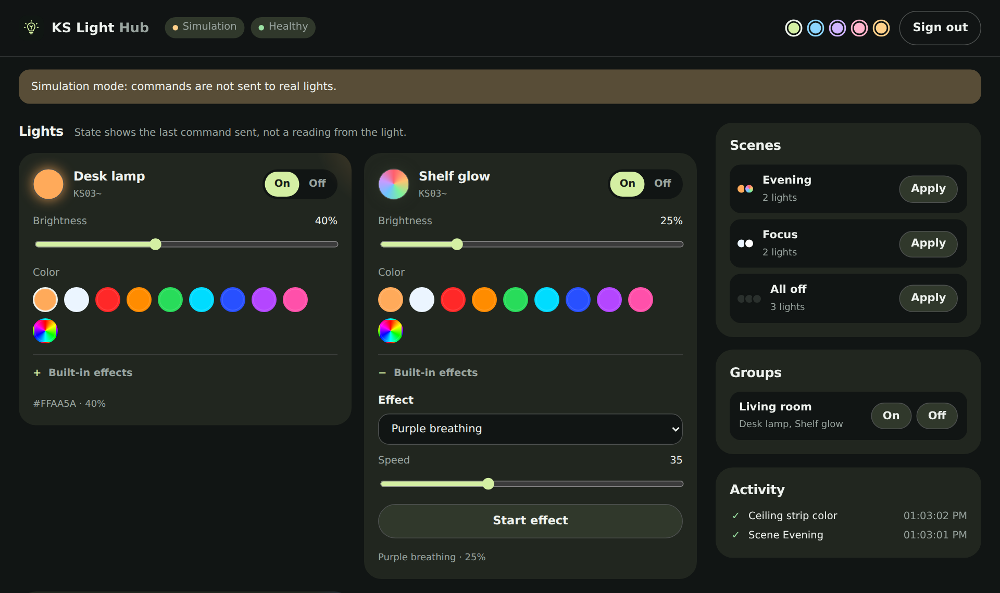
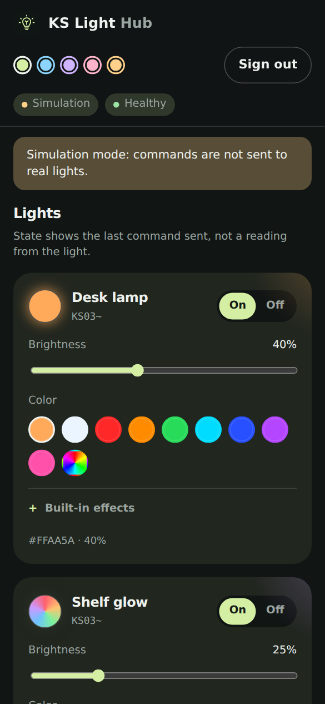
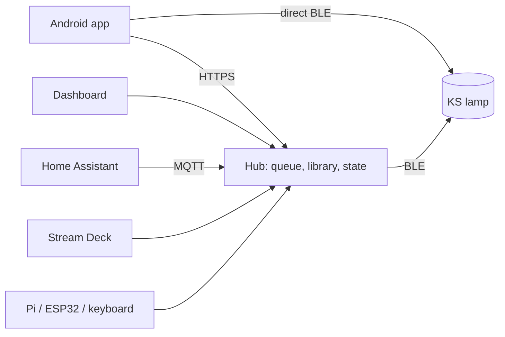

<div align="center">


# KS Light

Local control for KS Bluetooth lights. An Android app for direct control, and an optional hub that shares one Bluetooth connection with a browser dashboard, Home Assistant, Stream Deck and DIY controllers. No cloud account.

[](https://github.com/H4ch1Net/ks-led-controller/actions/workflows/tests.yml)
[](https://github.com/H4ch1Net/ks-led-controller/actions/workflows/android.yml)
[](https://github.com/H4ch1Net/ks-led-controller/actions/workflows/streamdeck.yml)
[](https://github.com/H4ch1Net/ks-led-controller/releases)
[](LICENSE)

[Download the APK](https://github.com/H4ch1Net/ks-led-controller/releases) · [Documentation](docs/README.md) · [Hub API](docs/HUB_API.md)

</div>

## Overview

KS Light replaces the vendor app for KS-branded Bluetooth LED lamps. It speaks the lamp's Bluetooth protocol directly, keeps everything on your own devices, and is honest about what it knows: the lamps do not report their state, so every status shown is the last command sent, not a reading.

There are two ways to use it:

| Mode | When to use it | What you need |
| --- | --- | --- |
| **Android app, direct Bluetooth** | One phone controlling its lights | Android 7.0+ |
| **Hub** | Several controllers sharing the same lamps: browser, Home Assistant, Stream Deck, keyboards, Raspberry Pi or ESP32 buttons | A computer with Bluetooth and Python 3.10+ |

Only one Bluetooth owner should control a lamp at a time. If you run the hub, point the phone at the hub instead of using direct Bluetooth for the same lamp.

## Screenshots

<table>
<tr>
<td></td>
<td></td>
<td></td>
</tr>
<tr><td align="center">Android: light controls</td><td align="center">Android: built-in effects</td><td align="center">Android: rooms and scenes</td></tr>
</table>


<p align="center"><sub>Hub dashboard (simulation mode)</sub></p>

<details>
<summary>More screenshots</summary>

<table>
<tr>
<td></td>
<td></td>
<td></td>
<td></td>
</tr>
<tr><td align="center">Saved colors</td><td align="center">Your lights</td><td align="center">Appearance</td><td align="center">Dashboard, narrow screen</td></tr>
</table>

How these are captured: [docs/images/README.md](docs/images/README.md).

</details>

## Features

| Area | Features |
| --- | --- |
| **Android app** | Scan and save multiple lights, default light, power, brightness, color picker, per-light color balance, named saved colors, rooms and scenes with backup/import, built-in lamp effects, phone-driven custom effects, home-screen widgets, Quick Settings tile, Device Controls, five accent themes |
| **Hub** | Authenticated local HTTP API, browser dashboard, per-light command queues, idempotent retries, operation polling and event feed, groups and scenes, per-light calibration, scoped controller credentials, optional state persistence, simulation mode |
| **Integrations** | Home Assistant through MQTT discovery, Stream Deck plugin (keys and dials), keyboard/launcher actions |
| **DIY (experimental)** | Raspberry Pi GPIO buttons, rotary encoders and status LEDs; ESP32 buttons and rotary control over HTTPS |
| **CLI** | Scan, list profiles, power, RGB or hex color, brightness, built-in effects, interactive terminal menu |

## Quick start

### Android

1. Download `KS-Light-<version>.apk` from [Releases](https://github.com/H4ch1Net/ks-led-controller/releases) and verify it against the published `SHA256SUMS` file. Avoid APK mirrors.
2. Install it and allow Bluetooth access. Android 11 and older may also ask for location access, which Android requires for Bluetooth scanning.
3. Tap **Add devices**, pick your light, and star it to make it the default.
4. Choose a color and brightness, then **Apply color**.

Building from source, signing and migration from older builds: [apps/android/README.md](apps/android/README.md).

### Hub and dashboard

```sh
git clone https://github.com/H4ch1Net/ks-led-controller.git
cd ks-led-controller
python -m venv .venv
. .venv/bin/activate              # Windows: .venv\Scripts\activate
python -m pip install --require-hashes -r requirements.lock

python -m ks_light.hub            # simulation with three demo lights
```

Open <http://127.0.0.1:8765/> and paste the temporary token the hub prints. Nothing is sent to real lights in simulation mode.

For real lights, copy [`examples/hub-multi-light.example.json`](examples/hub-multi-light.example.json) to `lights.json`, fill in your lamp addresses (`python led_control.py scan` lists them), and start the hub with a token of your own:

```sh
export KS_LIGHT_TOKEN="$(python -c 'import secrets; print(secrets.token_urlsafe(32))')"
python -m ks_light.hub --ble --config lights.json --library examples/hub-library.example.json
```

To run the hub permanently as a Windows task or a systemd service, with optional TLS for LAN clients, see [Service deployment](docs/SERVICE_DEPLOYMENT.md).

### Command line, without the hub

```sh
python led_control.py scan
python led_control.py rgb KS03~ --address AA:BB:CC:DD:EE:FF --hex ff8800
python led_control.py effect KS03~ --address AA:BB:CC:DD:EE:FF --name purple-breathing --speed 40
python led_menu.py                # interactive menu
```

All commands and options: [CLI guide](docs/CLI_GUIDE.md).

## Hub dashboard

The hub serves a small dashboard at `/` (no build step, no external requests). It shows every configured light with power, brightness, color and built-in effects, applies scenes and groups, and lists recent commands from all clients, including Home Assistant and Stream Deck. Updates arrive through the hub's event feed, so changes made elsewhere appear without reloading.

- Every API call still needs the bearer token. The token is kept for the browser tab, or on the device if you choose **Remember on this device**.
- Browser requests are accepted only from the dashboard's own origin, and only on loopback unless the hub runs with TLS.
- Disable it with `--no-dashboard` or `"dashboard": false` in the service configuration.

## Compatibility

| Profile | Status |
| --- | --- |
| `KS03~` | Exercised on real hardware: power, RGB, brightness, nine built-in effects |
| `KS03-`, `KS04-`, `KS01-`, `KS02-` | RGB protocol inherited from the vendor app; not hardware-verified |
| Other `KS` prefixes | Power only, inherited and unverified |

The tilde in `KS03~` is significant and differs from `KS03-`. Evidence levels and how to report a new lamp: [Protocol and testing](docs/PROTOCOL_AND_TESTING.md).

**Known limitations**

- The lamps do not report state. Status is the last command sent, and a failed delivery marks the state unknown. Commands are never replayed automatically.
- Built-in KS03 breathing uses seven fixed colors. Arbitrary-color breathing runs from the phone and stops when the app leaves the foreground.
- Group and scene commands reach each light independently; they are not synchronized.
- iOS is not supported. There is no Google Play or Stream Deck Marketplace listing.

## Project structure

```
apps/android/      Flutter app (Dart) with Kotlin widgets, tile and Device Controls
apps/streamdeck/   Stream Deck plugin (Node.js) that talks to the hub
apps/esp32/        Experimental ESP32 controller firmware (PlatformIO)
ks_light/          Python package: protocol, BLE transport, hub, MQTT bridge, controllers
ks_light/web/      Hub dashboard (static HTML, CSS, JavaScript)
led_control.py     Direct Bluetooth CLI
led_menu.py        Interactive terminal menu
examples/          Light catalogs, libraries and controller configurations
deploy/            Service files and Windows helpers
docs/              Guides and reference
release/           Source packaging inventory and toolchain pins
```



## Development

| Component | Check |
| --- | --- |
| Python | `python -m unittest discover -s tests` and `python -m ks_light.simulator` |
| Android | `flutter analyze` and `flutter test` in `apps/android` (Flutter 3.47.5) |
| Stream Deck | `npm ci && npm test && npm run build` in `apps/streamdeck` (Node 22) |
| ESP32 | `pio run -e esp32dev` in `apps/esp32`; host tests in `apps/esp32/test/native` |
| Source package | `python -m ks_light.source_package --check-inventory` |

New or removed files must be listed in [`release/source-files.json`](release/source-files.json); the source package check fails otherwise. More detail: [Development](docs/DEVELOPMENT.md).

## Troubleshooting

<details>
<summary>The light is not found during a scan</summary>

Make sure no other app or hub is connected to it; the lamp accepts one connection. Turn Bluetooth off and on, move closer, and check that the name starts with a known prefix (`python led_control.py list`).
</details>

<details>
<summary>The dashboard says the token was rejected</summary>

Use the exact `KS_LIGHT_TOKEN` value, or the single line in the service `token_file`. A simulation hub started without a token prints a new temporary token on every start.
</details>

<details>
<summary>Commands succeed but the color looks washed out</summary>

Adjust the light's color balance (Android) or calibration (hub `PUT /api/v1/lights/{id}/calibration`). The Stream Deck plugin also has saturation response curves.
</details>

<details>
<summary><code>browser_origin_not_allowed</code> from the API</summary>

Only the hub's own dashboard may call the API from a browser. Use the dashboard on the hub's address, or call the API from a non-browser client.
</details>

## Contributing

Bug reports are welcome. Include the app or plugin version, OS version, lamp prefix, whether you used direct Bluetooth or the hub, and the steps that failed. Remove device addresses, tokens and Wi-Fi credentials first. For a new lamp, say whether you observed the light change or only saw a successful write.

Licensed under [MIT](LICENSE). This is an independent project, not affiliated with KS, KeepSmile or Elgato.
